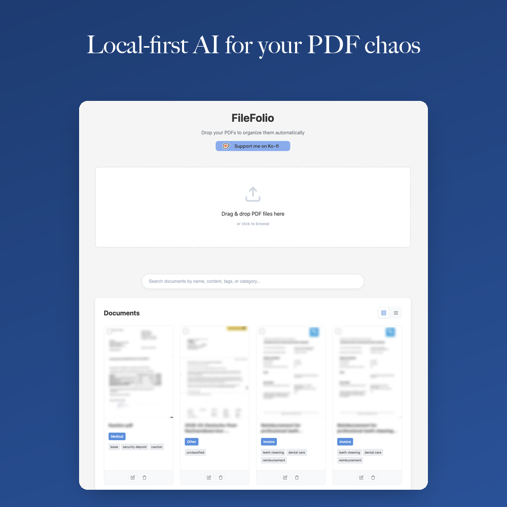

# FileFolio

A local-first document organization tool that automatically tags, categorizes, and renames your PDF files using AI. Keep your documents private while enjoying smart organization powered by local LLMs.

[](https://ko-fi.com/krishsub)



## Features

- **Smart organization** - AI-powered automatic categorization, tagging, and filename generation
- **Privacy-first** - All processing happens locally on your machine, no cloud services
- **Folder sync** - Watch a local folder and automatically import new PDFs
- **Backup & restore** - Export and import your entire library as a ZIP archive
- **Multi-language support** - UI available in multiple languages
- **Dark mode** - Toggle between light and dark themes
- **Drag & drop interface** - Simple and intuitive file upload
- **Full-text search** - Search through document content and metadata
- **Thumbnail previews** - Visual preview of your documents
- **Bulk operations** - Download multiple documents at once
- **Local LLM integration** - Uses Ollama for AI-powered features
- **OCR support** - Extract text from scanned documents

## Prerequisites

- Python 3.10+
- [Ollama](https://ollama.ai) installed locally
- Poppler (for PDF processing)
  - macOS: `brew install poppler`
  - Ubuntu/Debian: `apt-get install poppler-utils`
  - Windows: Download from [poppler releases](https://github.com/oschwartz10612/poppler-windows/releases/)
- Tesseract (for OCR on scanned documents)
  - macOS: `brew install tesseract`
  - Ubuntu/Debian: `apt-get install tesseract-ocr`
  - Windows: Download from [Tesseract releases](https://github.com/UB-Mannheim/tesseract/wiki)

## Quick start

1. **Clone the repository**
```bash
git clone https://github.com/imkrishsub/filefolio.git
cd filefolio
```

2. **Create and activate virtual environment**
```bash
python3 -m venv venv
source venv/bin/activate  # On Windows: venv\Scripts\activate
```

3. **Install dependencies**
```bash
pip install -r requirements.txt
```

4. **Start Ollama** (in a separate terminal)
```bash
ollama serve
```

5. **Run the application**
```bash
python backend/main.py
```

6. **Open your browser**
Navigate to: http://127.0.0.1:8000

## Configuration

### Custom port

Set a custom port using the `PORT` environment variable:

```bash
PORT=8080 python backend/main.py
```

## Testing

```bash
pytest
```

Full API and functionality coverage including unit tests, integration tests, and frontend tests.

## Project structure

```
filefolio/
├── backend/
│   ├── main.py          # FastAPI server
│   └── sync_service.py  # Folder sync service
├── frontend/
│   ├── static/
│   │   ├── app.js       # Frontend JavaScript
│   │   ├── style.css    # Styles
│   │   └── i18n.json    # Translations
│   └── templates/
│       └── index.html   # Main interface
├── tests/               # Test suite
├── uploads/             # PDF storage (created on first run)
├── thumbnails/          # Document thumbnails (created on first run)
├── data/                # Database (created on first run)
├── setup.cfg            # Linting and tool configuration
├── pytest.ini           # Test configuration
└── requirements.txt
```

## How it works

1. **Upload** - Drag and drop a PDF file into the web interface, or sync a local folder to automatically import new files
2. **Extract** - Text is extracted from the PDF (with OCR fallback for scanned documents)
3. **Analyze** - A local LLM analyzes the content to determine category, tags, and suggest a filename
4. **Organize** - The document is saved with metadata in a local SQLite database
5. **Search** - Find documents by content, category, tags, or filename

## Tech stack

- **Backend**: FastAPI (Python)
- **Frontend**: Vanilla JavaScript
- **Database**: SQLite
- **AI/LLM**: Ollama
- **PDF Processing**: PyPDF, pdf2image, pytesseract
- **Styling**: Custom CSS

## Contributing

Contributions are welcome! Please feel free to submit a pull request or open an issue.

## License

MIT License - see [LICENSE](LICENSE) file for details.

## Privacy

FileFolio is designed with privacy in mind:
- All documents stay on your local machine
- No data is sent to external servers
- AI processing happens locally via Ollama
- No telemetry or analytics
